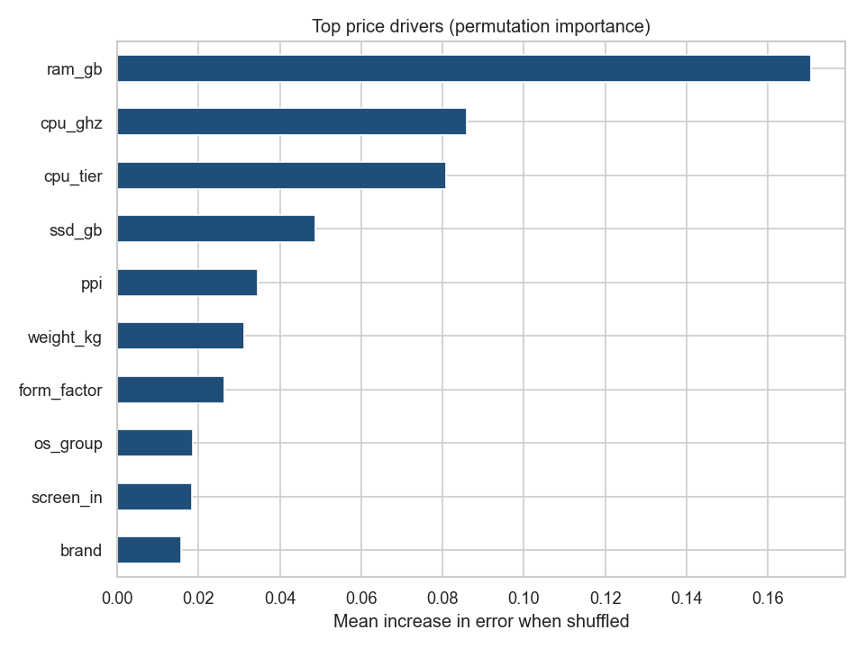

# Technology Pricing Analytics

**An end-to-end pricing-analytics project on real technology-product data.** It
ingests and stores the data, cleans messy specification strings into typed
features, analyzes pricing trends, builds a predictive pricing model, ranks the
price drivers, segments the market, projects forward value scenarios over time,
scores configurations in C++, and writes an executive summary, optionally with
an LLM.

> This README is also a learning guide. The later sections explain **what each
> part does and why**, so the author can speak to every decision.

---

## Table of contents
1. [Results at a glance](#results-at-a-glance)
2. [How to run](#how-to-run)
3. [Repository structure](#repository-structure)
4. [How it works, explained step by step](#how-it-works-explained-step-by-step)
5. [The methods in plain language](#the-methods-in-plain-language)
6. [Honesty notes and limitations](#honesty-notes-and-limitations)
7. [Skills demonstrated (mapped to the role)](#skills-demonstrated-mapped-to-the-role)
8. [Interview talking points](#interview-talking-points)

---

## Results at a glance

All figures are produced by the code from the cited data (re-run `python run_pipeline.py`).

| Result | Value |
|---|---|
| Price variation explained (R^2, held-out test set) | **~0.77** |
| Typical prediction error (MAE / MAPE) | **~$116 / ~15.5%** |
| Top price drivers | **RAM, CPU clock, CPU tier** (then SSD, display sharpness) |
| SSD price premium (median) | **~125%** ($810 vs $360) |
| Market tiers | **Budget ~$320 . Mainstream ~$617 . Premium ~$1,268** |
| C++ scorer vs Python | **identical to the cent** ($1,225.86, diff $0.00) |



---

## How to run

```bash
pip install -r requirements.txt
python run_pipeline.py                 # runs every stage, builds + runs the C++ scorer

# optional independent cross-check in R:
Rscript analysis/validate_findings.R

# score any configuration directly with the C++ tool:
#   args: ram_gb ssd_gb ppi cpu_ghz weight_kg screen_in has_ssd
./bin/score_price 16 512 157 2.8 1.6 15.6 1

# upgrade the executive summary from template to real LLM phrasing:
ANTHROPIC_API_KEY=sk-... python src/07_insight_writer.py
```

Outputs land in `reports/` (figures, `findings.md`, `findings_auto.md`,
`executive_summary.md`, `metrics.txt`) and `bin/` (the compiled C++ scorer).

---

## Repository structure

```
tech-pricing-analytics/
|- data/
|   |- raw/                 immutable source copy (+ provenance in data/README.md)
|   |- processed/           cleaned, typed, analysis-ready table
|- src/
|   |- 01_ingest.py         download + store raw data (hashed, idempotent)
|   |- 02_clean.py          parse spec strings -> typed features + quality gates
|   |- 03_eda_trends.py     EDA, pricing-trend tables, six business charts
|   |- 04_pricing_model.py  model, driver ranking, segmentation, auto-insights
|   |- 05_export_model.py   export a linear model for the C++ scorer
|   |- 06_price_scenarios.py  forward time-based value projection (assumptions)
|   |- 07_insight_writer.py   executive summary (LLM if key set, else fallback)
|   |- score_price.cpp      dependency-free C++ price scorer
|- analysis/
|   |- validate_findings.R  independent R cross-check (regression + ANOVA)
|- models/                  exported linear coefficients + sample config
|- bin/                     compiled C++ scorer (after build)
|- reports/
|   |- figures/             seven generated charts
|   |- findings.md          written findings (narrative)
|   |- findings_auto.md     machine-generated insight sentences
|   |- executive_summary.md LLM-or-fallback executive narrative
|   |- metrics.txt          model metrics from the latest run
|- docs/
|   |- data_governance.md   storage layers, lineage, quality, security
|- run_pipeline.py
|- requirements.txt
|- data/README.md           source citation, license, data dictionary
```

---

## How it works, explained step by step

This is the section to read before an interview. Each stage says **what** it
does and **why** that choice was made.

### Stage 01 - Ingest (`src/01_ingest.py`)
**What:** downloads the source dataset once and stores an immutable copy in
`data/raw/`, printing a SHA-256 hash of the exact bytes.
**Why:** raw data should never be edited in place. Keeping an untouched copy
plus a hash means any later run can be traced back to the exact input, which is
the first rule of trustworthy data work.

### Stage 02 - Clean & feature-engineer (`src/02_clean.py`)
**What:** turns human-readable spec strings into clean numeric/categorical
features. Examples: `"8GB"` to `8`; `"256GB SSD + 1TB HDD"` to `ssd_gb=256,
hdd_gb=1000, total=1256`; `"IPS Panel Full HD 1920x1080"` to width/height plus
`is_ips`, and a computed `ppi` (pixels per inch). It ends with **assertions**
that fail loudly if anything is off (row count preserved, prices positive, RAM
in a plausible range).
**Why:** models cannot use raw strings; the engineered features (especially
`ppi` and storage-by-type) are what actually carry pricing signal. The
assertions turn silent data corruption into an immediate, visible error.

### Stage 03 - EDA & trends (`src/03_eda_trends.py`)
**What:** computes median price by brand and form factor, the SSD premium, and
a correlation map of numeric specs against price; saves six charts.
**Why:** before modeling, you must understand the data. This is where we *see*
that RAM and SSD correlate most strongly with price, which the model later
confirms.

### Stage 04 - Pricing model, drivers, segments (`src/04_pricing_model.py`)
**What:** trains a **gradient-boosted regressor** on **log price**, evaluates it
on a held-out 20% test set (R^2, MAE, RMSE, MAPE), ranks drivers by
**permutation importance**, estimates interpretable **per-unit price effects**
with a log-linear model, and splits the market into three tiers with
**K-means**. It then writes plain-language insight sentences from the real
numbers.
**Why each choice:**
- *Log price* because price is multiplicative (a spec bump adds a *percentage*,
  not a flat dollar amount) and right-skewed; logging stabilizes that.
- *Gradient boosting* because it captures non-linear spec interactions and
  usually beats linear models on tabular data.
- *Permutation importance* because it measures real predictive contribution on
  unseen data, not just in-sample weights.
- *K-means* to find natural price tiers rather than drawing arbitrary cutoffs.

### Stage 05 + C++ - Export & fast scorer (`src/05_export_model.py`, `src/score_price.cpp`)
**What:** trains a transparent **linear** model on log price, exports its
coefficients to a plain text file, and a standalone **C++** program reads those
coefficients and scores any configuration with simple multiply-add-exp. Run
with no arguments, it reproduces Python's prediction exactly.
**Why:** this is the real "train in Python, deploy a tiny fast scorer" pattern.
A linear model is used here precisely because its coefficients port cleanly into
dependency-free C++, and matching Python to the cent is a clean correctness
check across two languages.

### Stage 06 - Forward time scenarios (`src/06_price_scenarios.py`)
**What:** projects a representative laptop from each tier forward over 0-4 years
under an explicit annual depreciation assumption (base 20%/yr), with a
low/high sensitivity band; saves a chart.
**Why:** the dataset is a snapshot with no dates, so it cannot show real history.
Forward *scenario* modeling under stated assumptions is the honest, useful way
to add a time dimension, and stating the assumption is the whole point.

### Stage 07 - Executive summary (`src/07_insight_writer.py`)
**What:** writes a four-paragraph executive summary. If `ANTHROPIC_API_KEY` is
set it sends the **fixed numeric facts** to the Anthropic API to rewrite them in
fluent business English; otherwise a deterministic template produces the same
summary. Either way the numbers are computed in code, not by the model.
**Why:** this is "AI-assisted analytics" done responsibly, the LLM controls
*phrasing*, never the *facts*, and the fallback guarantees the pipeline always
produces output.

---

## The methods in plain language

- **R^2 (0.77):** the share of price differences the model can account for. 0 is
  useless, 1 is perfect; 0.77 is solid for messy real product data.
- **MAE / MAPE ($116 / ~15.5%):** on average the prediction is off by about $116,
  or roughly 15-16% of the price.
- **Permutation importance:** shuffle one feature and see how much worse the
  model gets; the bigger the damage, the more that feature mattered.
- **Elasticity (log-linear):** approximately how much price moves per one extra
  natural unit of a spec (e.g., per +1 GB of RAM), holding others fixed.
- **K-means segmentation:** groups laptops so that members of a group are
  similar in price and specs, revealing Budget / Mainstream / Premium tiers.

---

## Honesty notes and limitations

These are stated on purpose; knowing what a model *cannot* say is part of using
it well.
- **Cross-sectional data:** it is a snapshot, so it reveals pricing *structure*,
  not real movements over *time*. Stage 06 is an assumption-driven *projection*,
  not observed history.
- **Currency:** prices were converted INR to USD at a fixed documented rate
  (83 INR/USD) for readability; native INR is retained.
- **Brand effects** partly capture unobserved brand/quality premium, not only
  hardware.
- **The R script** is provided to run locally; run it once with `Rscript` before
  citing its output.

---

## Skills demonstrated (mapped to the role)

- **Collect / manipulate / analyze large data sets, determine trends:** stages
  01-03.
- **Reports in visual form (graphs, charts, dashboards):** seven figures in
  `reports/figures/`.
- **Scripting in Python, R, and C++:** Python pipeline, R validation, C++ scorer.
- **Data communication that influences how data is organized/stored/cleaned:**
  layered storage, lineage, documented data dictionary, executive summary.
- **Insight development for business users:** auto-insights + executive summary.
- **Data management best practices (governance, quality, security):**
  `docs/data_governance.md` and the quality gates in stage 02.

---

## Interview talking points

Likely questions and honest, confident answers:

- **"Walk me through the project."** Start with the goal (understand and predict
  technology pricing), then the pipeline: ingest with a hash, clean spec strings
  into features with quality gates, explore trends, model log price with
  gradient boosting, rank drivers with permutation importance, segment with
  K-means, project forward scenarios, and score in C++.
- **"Why log price?"** Because price is multiplicative and right-skewed; logging
  makes a percentage change in price a linear target, which models handle better.
- **"Why two models?"** Gradient boosting for accuracy; a linear model for an
  interpretable, portable C++ scorer. Different jobs, different tools.
- **"How do you know the C++ scorer is correct?"** It reproduces Python's
  prediction to the cent on the sample config, a cross-language check.
- **"Can it show price trends over time?"** Not from this data, it is a snapshot.
  Stage 06 is a transparent forward projection under a stated depreciation
  assumption, which is honest scenario modeling, not observed history.
- **"Where does the LLM fit, and how do you keep it honest?"** It only rewrites
  fixed, code-computed facts into readable prose; it never produces numbers, and
  a deterministic fallback runs without it.
- **"What would you do next?"** Add a real time-stamped price feed for true trend
  analysis, try richer CPU/GPU benchmark features, and wrap the C++ scorer in a
  small API.

---

*Author: Tabasum Hamdard. Portfolio project. Dataset credited to its original
author (see `data/README.md`); redistributed for non-commercial, educational use.
Every figure is generated by the code from the cited data; no values are
hand-entered.*
